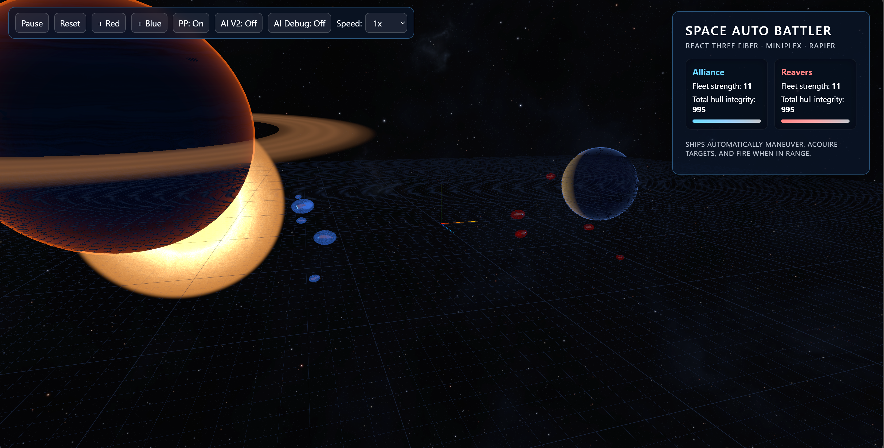

# SpaceAutoBattler



SpaceAutoBattler is a lightweight, research-oriented 3D space combat simulator. The project separates deterministic simulation logic (pure game logic under `src/game`) from rendering and UI (`src/components`, `App.tsx`) so you can run headless tests and fast experiments.

## Quick start

Clone, install dependencies, then either run the dev server (fast feedback) or build and serve the production bundle:

```powershell
git clone https://github.com/deadronos/SpaceAutoBattler.git
Set-Location SpaceAutoBattler
npm install

# Development (webpack dev server, opens browser)
npm start

# Build a production bundle (webpack -> `dist/`)
npm run build

# Serve the built files (serves `./dist` on :8080)
npm run serve

# Serve repository root (useful for static previews)
npm run serve:root
```

Open the local server at http://localhost:8080 (or the URL printed by the serve script).

Developer reference: a short, up-to-date layout of the `src/` directory is available at `spec/src-structure.md` in this repository. It lists the key entry points (`src/main.tsx`, `src/App.tsx`), the `src/game/` pure logic folder, and where to find types and utilities.

### Motion system specification

- Deterministic ship movement, renderer interpolation, and banking behaviour are defined in [`spec/spec-physical-movement.md`](spec/spec-physical-movement.md). The spec details canonical motion stats, the simulation loop expectations, and renderer smoothing guidance for implementers.

## Project layout

Edit TypeScript sources in `src/` only. Key folders:

- `src/main.tsx` — App bootstrap and renderer mounting
- `src/App.tsx` — React top-level application component
- `src/game/` — pure game logic: state container, systems, and ship blueprints
- `src/components/` — React / R3F components for rendering (Ship, Projectile, HUD)
- `src/types/` — canonical types including `GameState` (single source of runtime state types)
- `src/utils/` — seeded RNG and shared helpers
- `src/styles/` and `src/ui.html` — minimal UI templates and global styles

Build artifacts and generated files live in `dist/` (do not edit).

## Scripts & common commands

The project provides a set of npm scripts to run tests, checks and builds. Common ones:

- `npm install` — install dependencies
- `npm start` — webpack dev server (opens browser)
- `npm run build` — production webpack build (runs `prebuild` first)
- `npm run build:dev` — development webpack build
- `npm run serve` — simple static server that serves `./dist` on port 8080
- `npm run serve:root` — serve the repository root on port 8080
- `npm test` — run unit tests (Vitest, node/happy-dom environment)
- `npm run test:browser` — run Vitest configured for browser tests
- `npm run test:e2e` — run Playwright end-to-end tests
- `npm run typecheck` — TypeScript typecheck (no emit)
- `npm run lint` — ESLint (source files)
- `npm run lint:fix` — ESLint with autofix
- `npm run format` — Prettier formatting

There are also utility scripts used by the project lifecycle:

- `npm run prebuild` — runs a project-specific check (no sync reads) before building
- `npm run check-no-sync-reads` — detection script used by `prebuild`
- `npm run hash-assets` — compute asset hashes for the build
- `npm run validate-config` — config validation helper

Use `npm run` to list all scripts.

## Testing

Unit tests live under `test/vitest/` (logic-focused, deterministic). Playwright tests live under `test/playwright/` and test artifacts appear in `test-output/` and `playwright-report/` when run.

Recommended quick checks before committing:

```powershell
npm run typecheck; npm test
```

## Codebase notes

- Keep edits confined to `src/` (TypeScript). Do not edit files under `dist/` — they are build artifacts.
- Canonical runtime state: use the `GameState` type defined in `src/types/index.ts` for all simulation state.
- Determinism: runtime randomness is provided by the seeded RNG in `src/utils/rng.ts`; do not introduce nondeterministic behavior in simulation codepaths.
- Configuration-driven design: most gameplay and rendering parameters live under `src/config/`. Prefer editing config over hardcoding values.

Proposed small improvements (low-risk):

1. Add `docs/_index.md` or expand `llms.txt` with brief file summaries for discoverability.
2. Add a CI link-check job to validate README and docs links.
3. Add a lightweight API audit that exposes minimal test helpers for external tooling.

## Deployment

This project is configured to automatically deploy to GitHub Pages when a new tag is created (e.g., for releases).

### Initial Setup

Repository owners need to enable GitHub Pages:
1. Go to repository Settings → Pages
2. Set Source to "GitHub Actions"
3. No additional configuration needed

### Deployment Process

1. **Automatic deployment**: Push a git tag (e.g., `v1.0.0`) to trigger the GitHub Actions workflow
2. **Quality gates**: The workflow runs `npm run typecheck` and `npm test` before building
3. **Build and deploy**: Creates a production build and deploys to GitHub Pages
4. **File handling**: Automatically copies `spaceautobattler.html` to `index.html` for proper GitHub Pages routing

To create a release deployment:

```powershell
git tag v1.0.0
git push origin v1.0.0
```

The site will be available at `https://[username].github.io/SpaceAutoBattler/` after deployment completes.

### Local Testing

Test the deployment build process locally:

```powershell
npm run build:deploy
npm run serve
```

## Contributing

Fork the repository, create a feature branch, add tests, and open a pull request. Follow these rules:

- Edit TypeScript only under `src/` (do not modify build artifacts in `dist/`).
- Preserve deterministic behavior: use the seeded RNG and `GameState` for runtime state.
- Add unit tests in `test/vitest/` for logic changes and update `test/playwright/` for UI flows when relevant.
- Run `npm run typecheck` and `npm test` before opening a PR.

## License

MIT — see `LICENSE.MD`.
