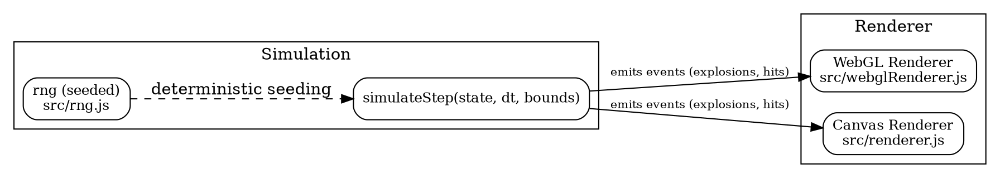

# Architecture Overview

This document describes the runtime flow and high-level contracts of SpaceAutoBattler and documents the project's move from Mermaid diagrams to DOT (Graphviz) sources.

## Key runtime components

1. `src/main.js` — Finds/creates the canvas and UI, chooses a renderer (WebGL2 → WebGL1 → Canvas2D), wires UI buttons, and starts the game loop (requestAnimationFrame).
2. `src/gamemanager.js` — Manager & state: holds global arrays (`ships`, `bullets`, `particles`, `stars`) and helper functions such as `reset(seed)`, `initStars`, `createStarCanvas`, `simulate(dt,W,H)`, `evaluateReinforcement`.
3. `src/simulate.js` — Simulation step (deterministic core): `simulate()` (manager) builds a `state` object and calls `simulateStep(state, dt, bounds)`. `simulateStep` advances ships & bullets, resolves collisions, awards XP/kills, and pushes numeric events into `state.explosions`, `state.shieldHits`, `state.healthHits`.
4. Rendering — Renderer (`src/webglRenderer.js` or `src/renderer.js`) reads exported arrays and events and draws frames. The WebGL path uses instancing and VBOs where available.
5. Input & UI — UI events mutate manager arrays or call manager methods (e.g., `reset()`), affecting subsequent simulation ticks.
---

## Flowchart (DOT)

The canonical diagram source is `docs/flowchart.dot` (DOT format). An SVG export `docs/flowchart.svg` is included for convenience in reviews.

### Why DOT (Graphviz)?

- DOT is a mature, widely-supported graph description language that provides more precise layout control than Mermaid for complex graphs.
- Switching to DOT allows easier integration with Graphviz tooling and CI-based rendering.

### Regenerating the SVG

Install Graphviz on your platform and then run the `dot` command from the repo root.

Windows (Chocolatey):

```powershell
choco install graphviz
```

macOS (Homebrew):

```bash
brew install graphviz
```

Linux (Debian/Ubuntu):

```bash
sudo apt-get install graphviz
```

Generate the SVG:

```bash
dot -Tsvg docs/flowchart.dot -o docs/flowchart.svg
```

### Guidelines

- Keep `docs/flowchart.dot` as the single source-of-truth for diagrams. Include the regenerated `flowchart.svg` in the same PR when you change the diagram.
- Prefer semantic node names and small, focused graphs. Split into multiple DOT files if a diagram becomes large.
- Use subgraphs/clusters to group related components (for example `cluster_simulation` and `cluster_renderer`).

### Example DOT snippet

```dot
digraph spaceautobattler {
   rankdir=LR;
   node [shape=box, style=rounded, fontsize=12];

   subgraph cluster_simulation {
      label="Simulation";
      # Architecture Overview

      This document describes the runtime flow and high-level contracts of SpaceAutoBattler and documents the project's move from Mermaid diagrams to DOT (Graphviz) sources.

      ## Key runtime components

      1. `src/main.js` — Finds/creates the canvas and UI, chooses a renderer (WebGL2 → WebGL1 → Canvas2D), wires UI buttons, and starts the game loop (requestAnimationFrame).

      2. `src/gamemanager.js` — Manager & state: holds global arrays (`ships`, `bullets`, `particles`, `stars`) and helper functions such as `reset(seed)`, `initStars`, `createStarCanvas`, `simulate(dt,W,H)`, `evaluateReinforcement`.

      3. `src/simulate.js` — Simulation step (deterministic core): `simulate()` (manager) builds a `state` object and calls `simulateStep(state, dt, bounds)`. `simulateStep` advances ships & bullets, resolves collisions, awards XP/kills, and pushes numeric events into `state.explosions`, `state.shieldHits`, `state.healthHits`.

      4. Rendering — Renderer (`src/webglRenderer.js` or `src/renderer.js`) reads exported arrays and events and draws frames. The WebGL path uses instancing and VBOs where available.

      5. Input & UI — UI events mutate manager arrays or call manager methods (e.g., `reset()`), affecting subsequent simulation ticks.

      ---

      ## Flowchart (DOT)

      The canonical diagram source is `docs/flowchart.dot` (DOT format). An SVG export `docs/flowchart.svg` is included for convenience in reviews.

      ### Why DOT (Graphviz)?

      - DOT is a mature, widely-supported graph description language that provides more precise layout control than Mermaid for complex graphs.
      - Switching to DOT allows easier integration with Graphviz tooling and CI-based rendering.

      ### Regenerating the SVG

      Install Graphviz on your platform and then run the `dot` command from the repo root.

      Windows (Chocolatey):

      ```powershell
      choco install graphviz
      ```

      macOS (Homebrew):

      ```bash
      brew install graphviz
      ```

      Linux (Debian/Ubuntu):

      ```bash
      sudo apt-get install graphviz
      ```

      Generate the SVG:

      ```bash
      dot -Tsvg docs/flowchart.dot -o docs/flowchart.svg
      ```

      ### Guidelines

      - Keep `docs/flowchart.dot` as the single source-of-truth for diagrams. Include the regenerated `flowchart.svg` in the same PR when you change the diagram.
      - Prefer semantic node names and small, focused graphs. Split into multiple DOT files if a diagram becomes large.
      - Use subgraphs/clusters to group related components (for example `cluster_simulation` and `cluster_renderer`).

      ### Example DOT snippet

      ```dot
      digraph spaceautobattler {
         rankdir=LR;
         node [shape=box, style=rounded, fontsize=12];

         subgraph cluster_simulation {
            label="Simulation";
            sim [label="simulateStep(state, dt, bounds)"];
            rng [label="rng (seeded)\nsrc/rng.js"];
         }

         subgraph cluster_renderer {
            label="Renderer";
            webgl [label="WebGL Renderer\nsrc/webglRenderer.js"];
            canvas [label="Canvas Renderer\nsrc/renderer.js"];
         }

         sim -> webgl [label="emits events (explosions, hits)", fontsize=10];
         sim -> canvas [label="emits events (explosions, hits)", fontsize=10];
         rng -> sim [style=dashed, label="deterministic seeding"];
      }
      ```

      ---

      ## Contracts

      - `simulateStep(state, dt, bounds)` — mutates `state` and may push to `state.explosions`, `state.shieldHits`, `state.healthHits`.

      ### Event shapes

      - Explosion: `{ x, y, team }`
      - Shield hit: `{ id, hitX, hitY, team, amount }`
      - Health hit: `{ id, hitX, hitY, team, amount }`

      - RNG: call `srand(seed)` before simulation to get deterministic runs. Use `srandom`, `srange`, `srangeInt` for simulation randomness.

      ---

      ## Edge cases & recommendations

      - Headless/test environments: `main.js` is defensive but tests may stub or fabricate a 2D canvas context (see `gamemanager.createStarCanvas`).
      - VBO allocation: track bytes and use `safeDrawInstanced` to handle buffer growth or chunked draws.
      - Avoid `Math.random()` inside simulation code when determinism is required.

      ---

      ## Next steps

      - When updating diagrams, include both `docs/flowchart.dot` and the regenerated `docs/flowchart.svg` in your PR.
      - Consider adding a CI step that validates or regenerates SVGs from DOT sources.

      ---

      Related resources

      - `docs/flowchart.dot` — canonical DOT source (edit this file)
      - `docs/flowchart.svg` — generated SVG (update via `dot -Tsvg`)

      If you need help editing or converting diagrams, open an issue or ping the maintainers in the repository.


```bash
brew install graphviz
```

Linux (Debian/Ubuntu):

```bash
sudo apt-get install graphviz
```

Generate the SVG:

```bash
dot -Tsvg docs/flowchart.dot -o docs/flowchart.svg
```

Guidelines

- Keep `docs/flowchart.dot` as the single source-of-truth for diagrams. Include the regenerated `flowchart.svg` in the same PR when you change the diagram.
- Prefer semantic node names and small, focused graphs. Split into multiple DOT files if a diagram becomes large.
- Use subgraphs/clusters to group related components (for example `cluster_simulation` and `cluster_renderer`).

Example DOT snippet



## Contracts

- `simulateStep(state, dt, bounds)` — mutates `state` and may push to `state.explosions`, `state.shieldHits`, `state.healthHits`.
- Event shapes:
  - Explosion: `{ x, y, team }`
  - Shield hit: `{ id, hitX, hitY, team, amount }`
  - Health hit: `{ id, hitX, hitY, team, amount }`
- RNG: call `srand(seed)` before simulation to get deterministic runs. Use `srandom`, `srange`, `srangeInt` for simulation randomness.

## Edge cases & recommendations

- Headless/test environments: `main.js` is defensive but tests may stub or fabricate a 2D canvas context (see `gamemanager.createStarCanvas`).
- VBO allocation: track bytes and use `safeDrawInstanced` to handle buffer growth or chunked draws.
- Avoid `Math.random()` inside simulation code when determinism is required.

## Next steps

- When updating diagrams, include both `docs/flowchart.dot` and the regenerated `docs/flowchart.svg` in your PR.
- Consider adding a CI step that validates or regenerates SVGs from DOT sources.

Related resources

- `docs/flowchart.dot` — canonical DOT source (edit this file)
- `docs/flowchart.svg` — generated SVG (update via `dot -Tsvg`)

If you need help editing or converting diagrams, open an issue or ping the maintainers in the repository.
- VBO allocation: track bytes and use `safeDrawInstanced` to handle buffer growth or chunked draws.

