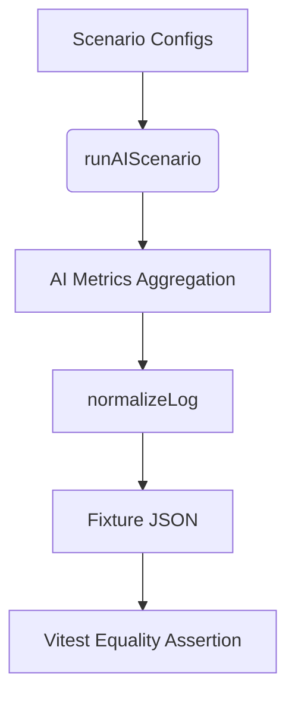

# Design — AI Scenario Determinism Refresh

**Related Requirements:** 2025-09-28 — AI Scenario Determinism Refresh (`memory/requirements.md`)

## Overview

Recent AI scoring and metrics instrumentation adjusts the deterministic outputs emitted by `runAIScenario`. The Vitest fixtures that assert those outputs must be refreshed so the regression suite validates the new, richer telemetry (first-shot timing, histogram buckets, posture changes). This design captures how the harness, normalization pipeline, and fixtures interact, and prescribes a controlled process to regenerate fixtures while guarding against accidental drift.

## Architecture

- `runAIScenario(config: AIScenarioConfig)` drives the seeded AI harness, producing command + position logs and in-memory metrics snapshots.
- Diagnostic hooks populate `state.ai.metrics` with shot timing, distance, and vertical dispersion data prior to serialization.
- `normalizeLog(log: AIScenarioLog)` rounds headings, thrust, and positions to three decimals for stable diffs across platforms.
- Vitest fixtures under `test/vitest/fixtures/` store the normalized log snapshots for canonical scenarios.
- `test/vitest/ai-scenario-harness.spec.ts` executes the same scenarios at test time and asserts deep equality with the fixtures.
- The helper script `tmp/refresh-ai-fixtures.ts` regenerates all fixtures by re-running the harness and applying the same normalization logic used in tests.

## Data Flow

## Interfaces

- `AIScenarioConfig`: configuration contract for harness runs (name, tick count, interval, seed, ship specs).
- `AIScenarioLog`: serialized result containing `entries` (commands + positions) and `metrics`.
- `normalizeLog(log: AIScenarioLog): AIScenarioLog`: rounds numeric output for determinism.
- `tmp/refresh-ai-fixtures.ts`: batch regeneration utility powered by `runAIScenario` + `normalizeLog`.

## Error Handling Matrix

| Failure Mode | Detection Mechanism | Procedure | Expected Response |
| --- | --- | --- | --- |
| Fixture regeneration script fails (TypeScript error or runtime exception) | `npx tsx tmp/refresh-ai-fixtures.ts` exits non-zero | Inspect stack trace, resolve harness/runtime issue, rerun script | Script completes successfully and fixtures update |
| Fixture drift detected by Vitest after harness changes | `test/vitest/ai-scenario-harness.spec.ts` equality assertion fails | Run refresh script, review git diff for plausibility, rerun tests | Tests pass with updated fixtures |
| Non-deterministic harness output (e.g., RNG misuse) | Fixture diffs vary between consecutive regeneration attempts | Investigate harness code for unseeded randomness; add deterministic seed usage; regenerate fixtures | Regenerated fixtures remain stable across runs |

## Unit Testing Strategy

- `test/vitest/ai-scenario-harness.spec.ts` remains the primary regression check, ensuring normalized harness output matches fixtures for all curated scenarios.
- Optional manual verification: set `AI_WRITE_SCENARIO_JSON=1` and run the spec to dump comparison artifacts in `tmp/` when debugging drift.
- Post-refresh validation gate: run `npm test` and `npm run typecheck` to guarantee no unintended regressions.

## Implementation Plan

1. Use `npx tsx tmp/refresh-ai-fixtures.ts` to regenerate the escort, bomber intercept, and artillery retreat fixtures with the latest harness logic.
2. Review the JSON diffs to confirm changes reflect the expected KPI enhancements (shot timings, histogram counts, command scores).
3. Update repository fixtures under `test/vitest/fixtures/` with the regenerated snapshots and ensure formatting remains stable.
4. Re-run `npm test` (Vitest) and `npm run typecheck` to validate the refreshed fixtures.
