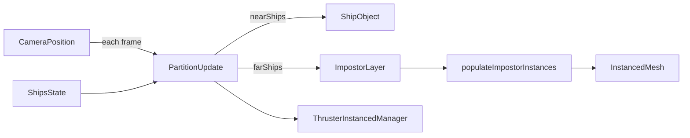

# DESIGN002 — Ship LOD visibility refresh

Date: 2025-10-05
Author: Codex (GPT-5 Codex agent)

Confidence: 82% — partition refresh logic is well understood; impostor orientation testing needs careful mocking but is tractable.

## Goal

Restore visible ship hulls after the instancing refactor by ensuring the LOD manager refreshes its near/far cohorts every frame, keeps distant impostor quads billboarded toward the camera, and validates projectile/instancing pathways for regressions.

## Context & Problem Statement

- The recent instancing work introduced `ShipLODManager`, `ThrusterInstancedManager`, and instanced projectile/muzzle layers.
- Hull meshes vanish in the default battle view because the LOD partition is only computed during initial render; all ships remain in the impostor cohort regardless of camera motion.
- The impostor layer relies on per-frame orientation updates that currently run, but hull absence masks fleet silhouettes and regresses UX expectations.
- Need to audit related instanced systems (thrusters/projectiles) to confirm no secondary regressions during the fix.

## Scope

In scope:

- `src/components/lod/ShipLODManager.tsx`
- `src/components/layers/ShipsLayer.tsx` (only if wiring adjustments required)
- `src/components/lod/__tests__` / `test/components/lod/ShipLODManager.spec.ts`
- Helper utilities introduced to support tests (e.g., new exported pure functions)
- Minor renderer config tweaks (distance thresholds, bloom flags) if necessary for hull visibility

Out of scope:

- Overhauling GLTF asset loading or introducing full instanced hull rendering
- Deep rework of thruster/projectile instancing (audit only, no structural change unless a regression is found during implementation)

## Proposed Architecture

1. **Partition Refresh Loop**
   - Promote the LOD classification to a frame-driven update: store the current partition in component state and recompute each `useFrame` tick using the live camera position.
   - Track the most recent partition in a ref so recomputations can be compared cheaply; only trigger `setPartition` when cohort membership changes.
   - Maintain hysteresis map (`lodStateRef`) to avoid oscillation across threshold boundaries.

2. **Dynamic Threshold Defaults**
   - Increase `DEFAULT_DISTANCE_THRESHOLD` (e.g., 1800) so the default camera immediately yields near ships; continue to support props for overrides.
   - Document and test the threshold so integration cannot regress silently.

3. **Impostor Update Helper**
   - Extract the per-instance update loop inside `ShipImpostorLayer` into a pure helper `populateImpostorInstances(...)` that receives camera quaternion/position, ships, and instanced mesh references.
   - Helper returns metadata (`count`, `saturated`) for logging and tests, and is resilient to null mesh refs.

4. **Partition Update Helper**
   - Implement `computeLodPartition(...)` (thin wrapper around existing logic) plus `partitionsEqual(...)` for deterministic comparisons used both in component and tests.

5. **Instrumentation & Logging**
   - Maintain saturation warnings for capacity issues (reuse `createSaturationWarningState`).
   - Consider `console.debug` hooks guarded by dev flags if hysteresis toggles rapidly (future enhancement, not required now).

## Data Flow



- `useFrame` callback receives the latest `camera.position`; combined with `shipsRef.current` it invokes `computeLodPartition`.
- The resulting `nearShips` array controls which `ShipObject` components mount; the same set is passed to `ThrusterInstancedManager`.
- `populateImpostorInstances` updates matrices/colors on the impostor mesh and toggles `mesh.visible` / `mesh.count`.

## Interfaces & Contracts

```ts
export function computeLodPartition(
  ships: readonly ShipEntity[],
  cameraPosition: Vector3,
  threshold: number,
  hysteresis: number,
  lodState: Map<number, LodLevel>,
): LodPartitionResult;

export function partitionsEqual(a: LodPartitionResult, b: LodPartitionResult): boolean;

export interface PopulateImpostorParams {
  ships: readonly ShipEntity[];
  capacity: number;
  cameraQuaternion: Quaternion;
  cameraPosition: Vector3;
  mesh: InstancedMesh | null;
  temp: {
    matrix: Matrix4;
    scale: Vector3;
    quat: Quaternion;
    pos: Vector3;
    color: Color;
  };
}

export function populateImpostorInstances(params: PopulateImpostorParams): {
  count: number;
  saturated: boolean;
};
```

## Error Handling Matrix

| Scenario                                  | Detection                                            | Response                                                         | Notes                                         |
| ----------------------------------------- | ---------------------------------------------------- | ---------------------------------------------------------------- | --------------------------------------------- |
| Instanced mesh ref missing                | `populateImpostorInstances` receives `mesh === null` | Return `{ count: 0, saturated: false }` without throwing         | Maintains resilience during Suspense fallback |
| Capacity saturation                       | Helper detects index >= capacity                     | Set `saturated = true`, clamp writes, log via `warnOnSaturation` | Existing warning infrastructure reused        |
| Ship array empty mid-frame                | Loop completes with zero count                       | Mesh `visible = false`, `count = 0`                              | Prevents stale impostor quads                 |
| Threshold misconfiguration (negative/NaN) | Validate inputs before use                           | Fallback to defaults (clamp to positive numbers)                 | Implement simple guards in component          |

## Testing Strategy

- Extend `test/components/lod/ShipLODManager.spec.ts` with:
  - Partition refresh test simulating camera movement across the threshold using `computeLodPartition` and ensuring `partitionsEqual` gates updates.
  - Default threshold regression test asserting ships at ±300 units classify as near with the updated constants.
  - Helper test stubbing an `InstancedMesh` (mock with minimal API) to verify `populateImpostorInstances` sets matrix/quaternion to the camera orientation and toggles `visible/count`.
- Run `npx tsc --noEmit` and `npm test` (Vitest suite) locally.
- Optional manual check: load scene, confirm hulls visible at default zoom (document in reflection if performed).

## Work Plan

1. Finalize requirements + design (this document) and update memory tasks. _(Status: In Progress — TASK245 subtask 1.1)_
2. Implement code changes:
   - Introduce helpers and stateful partition logic in `ShipLODManager.tsx`.
   - Adjust default thresholds and reuse helpers.
   - Wire helper into `ShipImpostorLayer` and maintain cleanup effects.
3. Update/author Vitest coverage listed above.
4. Execute validation commands, capture results.
5. Update task file, note reflections, prepare handoff summary.

## Risks & Mitigations

- **Risk:** Per-frame state updates could trigger extra React renders. _Mitigation:_ Only call `setPartition` when `partitionsEqual` reports a difference; keep helper allocations minimal.
- **Risk:** Mocking `InstancedMesh` in tests may diverge from Three.js behaviour. _Mitigation:_ Implement lightweight mock capturing last matrix/quaternion values and assert against them; ensure helper works with minimal API.
- **Risk:** Raising default threshold could impact performance. _Mitigation:_ Document change, keep impostor capacity instancing, and monitor counts in saturation logs; consider future dynamic thresholds based on FOV.

## Open Questions

- Should LOD thresholds adapt to camera FOV/zoom dynamically? (Out of scope; document as follow-up if needed.)
- Do we need to update thruster/projectile instancing beyond audit? (Investigate during implementation; plan currently assumes no changes.)

## References

- `memory/tasks/TASK008-ship-lod-impostors.md` — original instancing task
- `src/components/lod/ShipLODManager.tsx` — current implementation baseline
- `test/components/lod/ShipLODManager.spec.ts` — existing partition tests
