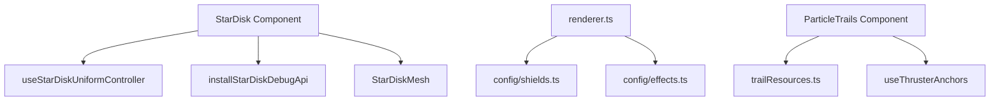

# DESIGN203 — Renderer Large File Refactor Planning

Status: Draft
Date: 2025-10-27
Related Tasks: TASK412
Requirements: 2025-10-27 — Renderer Large File Refactor Planning (TASK412)

## Confidence & Execution Strategy

- Confidence Score: 80%
- Strategy: Proof-of-Concept first (medium-confidence). Build lightweight spikes for extracted modules (e.g., `useStarDiskUniformController`, `shieldConfig.ts`) behind feature flags/tests before fully migrating call sites.

## Overview

Large renderer modules (`StarDisk.tsx`, `config/renderer.ts`, `ParticleTrails.tsx`) exceed 400 LOC and mix multiple responsibilities (runtime hooks, debug wiring, config glob). This plan documents how to decompose them into smaller, testable modules while preserving deterministic behavior and debug tooling.

## Architecture Snapshot

## Data Flow Impact

- **StarDisk**: `useStarDiskUniformController` consumes `GameState`, `camera`, and shader refs, emitting uniform updates each frame; `installStarDiskDebugApi` registers global helpers guarded by `isCopilotDebugEnabled()`.
- **Renderer Config**: `config/shields.ts` exports shield visuals/tuning plus mutation helpers; `config/effects.ts` exports thruster glow, particle trails, hull tints. Main `renderer/index.ts` re-exports for compatibility.
- **ParticleTrails**: `trailResources.ts` manages shared GPU buffers/materials; `useThrusterAnchors` loads GLTF anchor transforms and exposes memoized world/local helpers.

## Module Decomposition Plans

### StarDisk Component (`src/components/environment/StarDisk.tsx`)

- **Current Responsibilities**: prop normalization, material acquisition, GLTF/textures, uniform updates, debug overlays, bloom wiring, telemetry globals.

- **Proposed Modules**:
  1. `src/components/environment/starDisk/useStarDiskUniformController.ts` — Hook returning refs + `advanceUniforms(delta)` wired via `useFrame`.
  2. `src/components/environment/starDisk/debugApi.ts` — `installStarDiskDebugApi(meshRef, shaderRef, options)` exposing debug toggles, cleanup on dispose.
- **Interfaces**:
  - `export interface StarDiskUniformControllerDeps { state: GameState; mesh: Mesh; shaderMaterial: ShaderMaterial; renderer: WebGLRenderer; }`
  - `export function useStarDiskUniformController(deps: StarDiskUniformControllerDeps): void`
  - `export function installStarDiskDebugApi(options: { mesh: Mesh | null; material: ShaderMaterial | MeshBasicMaterial | null; enabled: boolean; onDispose?: () => void; }): () => void`
- **Shared Dependencies**: `useOptionalGameState`, `MainSequenceStarMaterial`, `wrapStarTime`, `computeViewAlignment`, debug flag utilities.
- **Error/Risk Notes**: Must preserve shared refs to avoid double material creation; guard cleanup when mesh/material unavailable; maintain deterministic uniform time fallback when simulation stalls.
- **Testing**: New hook tests verifying time fallback and camera alignment math determinism; debug API unit tests ensuring helpers register only with debug flag.

### Renderer Config (`src/config/renderer.ts`)

- **Current Responsibilities**: motion smoothing defaults, shield visuals/tuning, hull tint, thruster glow, particle trails, bloom presets.

- **Proposed Modules**:
  1. `src/config/shields.ts` — shield visuals, tuning maps, ripple settings, `setGlobalShieldMaterial`.
  2. `src/config/effects.ts` — thruster glow, particle trails, hull tint maps, team colors.
  3. `src/config/renderer.ts` becomes façade re-export plus motion/postprocessing config.
- **Interfaces**:
  - `export type ShieldVisualMap = Record<ShipHull, ShieldVisualSettings>`
  - `export const SHIELD_VISUALS: ShieldVisualMap`
  - `export function getShieldVisuals(hull: ShipHull): ShieldVisualSettings`
  - `export const PARTICLE_TRAILS_CONFIG: ParticleTrailsConfig`
- **Shared Dependencies**: `ShipHull` enum, `RendererMotionConfig`, `TeamColorPalette`, config defaults.
- **Error/Risk Notes**: Update all importers; ensure re-export to avoid breaking `import { SHIELD_VISUALS } from 'config/renderer'`; keep mutation functions (e.g., `setGlobalShieldMaterial`) accessible post-split.
- **Testing**: Extend existing config specs or add new `config/shields.spec.ts` verifying defaults, mutation side effects, ripple tuning invariants.

### ParticleTrails Component (`src/components/ParticleTrails.tsx`)

- **Current Responsibilities**: GPU buffer/material creation, GLTF anchor loading, RNG seeding, resource lifecycle, frame updates, visibility toggles.

- **Proposed Modules**:
  1. `src/renderer/particles/trailResources.ts` — export `createParticleTrailResources`, `createTrailMaterial`, `disposeTrailResources`.
  2. `src/renderer/particles/useThrusterAnchors.ts` — hook returning local/world anchor computations using `useGLTF` per hull.
- **Interfaces**:
  - `export interface ParticleTrailResources { geometry: InstancedBufferGeometry; material: ShaderMaterial; attributes: TrailAttributes }`
  - `export function createParticleTrailResources(config: ParticleTrailsConfig): ParticleTrailResources`
  - `export function useThrusterAnchors(hull: ShipHull): ThrusterAnchorSet`
- **Shared Dependencies**: `PARTICLE_TRAILS_CONFIG`, `THRUSTER_GLOW_CONFIG`, seeded RNG utilities, GLTF loader cache.
- **Error/Risk Notes**: Hooks must remain top-level to satisfy React rules; refactor ensures resources reused without double allocation; need cleanup to avoid GPU leaks.
- **Testing**: Add unit tests for resource factory (attribute lengths, defaults) and anchor hook (returns deterministic anchor positions using mocked GLTF data).

## Error Matrix

| Area                     | Potential Failure                                       | Detection                                 | Planned Response                                                             |
| ------------------------ | ------------------------------------------------------- | ----------------------------------------- | ---------------------------------------------------------------------------- |
| StarDisk uniform hook    | Missing refs leading to undefined uniform updates       | Vitest hook tests / runtime guard logs    | Early-return with warning; maintain existing fallback path                   |
| StarDisk debug API       | Globals not cleaned up after unmount                    | Unit test ensuring dispose clears helpers | Hook returns disposer invoked in `useEffect` cleanup                         |
| Renderer config splits   | Import paths outdated causing runtime errors            | TypeScript compile + lint                 | Provide re-export façade, run codemod to update imports                      |
| Particle trail resources | Double resource allocation per hull increases GPU usage | Resource unit tests & instrumentation     | Share resource singletons, add `disposeTrailResources` for explicit teardown |
| Thruster anchor hook     | Violating React hook rules                              | ESLint react-hooks plugin                 | Keep `useGLTF` inside hook called unconditionally by component               |

## Unit Testing Strategy

- Extend Vitest suites:
  - `test/config/shields.spec.ts` covering shield visual/tuning re-export and mutation.
  - `test/renderer/particles/trailResources.spec.ts` ensuring buffer attributes match config.
  - `test/components/star-disk-uniform-controller.spec.tsx` mocking camera/state to validate uniform time fallback.
  - `test/components/star-disk-debug-api.spec.ts` verifying helper registration/cleanup.
- Update existing `ParticleTrails` specs to use injected resources from new factories.
- Smoke tests ensuring façade `config/renderer.ts` re-export matches previous surface (e.g., `expect(Object.keys(rendererConfig)).toMatchSnapshot()`).

## Follow-Up

- Prepare codemod scripts to adjust imports (`config/renderer` -> `config/shields` / `config/effects`).
- Coordinate with TASK410/411 to align StarDisk material refactors and safe kinematics changes for consistent debug instrumentation.
