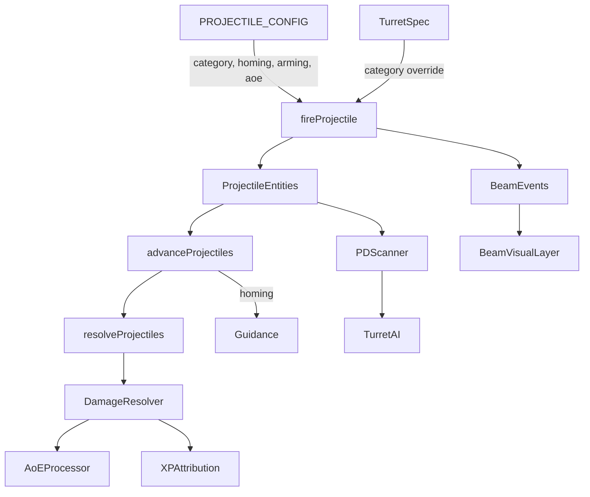

# TASK248 - Weapon Category Expansion

**Status:** Draft
**Added:** 2025-10-14
**Updated:** 2025-10-14
**Confidence:** 0.78 (medium-high — existing projectile pipeline is known, but guided missiles + beam visuals introduce new behaviours.)

## Problem Statement

The current projectile system only models ballistic bullets keyed by `bulletType`. We need to extend the simulation to support homing missiles, torpedoes with arming delays and AoE warheads, and hitscan-style beams while ensuring renderer materials, AI targeting, and balance configs stay data-driven. Hull loadouts should expose new weapon roles (e.g., fighter torpedo rack, PD turrets on larger hulls).

## Requirements Traceability

| Req | Summary | Coverage Plan |
| --- | ------- | ------------- |
| R1 | Spawn missiles/torpedoes with homing/arming/AoE from config | fireProjectile unit tests validating component fields |
| R2 | Prevent unarmed detonation on early impact | damage AoE spec with time-stepped simulation |
| R3 | Apply AoE damage and XP on detonation | damage AoE spec verifying multi-ship damage + XP |
| R4 | Beams raycast and emit visuals immediately | beam spec covering hit + beam event registration |
| R5 | Point-defense turrets prioritise missiles | PD decision spec targeting missile entities |

## Architecture Overview



- **Simulation loop additions:**
  - `fireProjectile` now branches per `category` and seeds runtime metadata.
  - `advanceProjectiles` updates `armed` status, applies homing steering, and keeps beams short-lived.
  - `resolveProjectiles` applies arming delay, AoE, and delegates to a new helper for hull damage.
  - A new `fireBeam` helper performs raycasts and spawns a short TTL beam visual record.

- **Renderer updates:**
  - New materials (`missile`, `torpedo`, `beam`) registered with instance-friendly flags.
  - Geometry helper returns capsule/cylinder meshes for missiles/torpedoes and beam quads.
  - Beam visuals tracked via `state.visuals.beams` (new list) consumed by `BeamLayer`.

- **AI updates:**
  - Extend turret prioritisation to recognise `pointDefense` role and query incoming missile entities within configurable PD range per hull/turret.

## Data Flow & Interfaces

### Types

```ts
interface ProjectileComponent {
  category: 'bullet' | 'missile' | 'torpedo' | 'beam';
  spawnTime: number;
  targetId?: number;
  homing?: { turnRate: number; lead?: boolean };
  armingTime?: number;
  armed: boolean;
  aoeRadius?: number;
  beamTtl?: number; // for visuals only
}

interface ProjectileConfigItem {
  category: ProjectileComponent['category'];
  damageType?: DamageType; // override hull default
  homing?: { turnRate: number; lead?: boolean };
  armingTime?: number;
  aoeRadius?: number;
  beam?: { ttl: number; width: number };
}

interface TurretSpec {
  category?: ProjectileComponent['category'];
  targetPreference?: 'ship' | 'projectile';
  pdRange?: number;
}
```

### Beam Event Interface

```ts
interface BeamEvent {
  id: number;
  sourceId: number;
  origin: Vector3;
  direction: Vector3;
  length: number;
  ttl: number;
  bulletType?: string;
}
```

`GameState.visuals.beams: BeamEvent[]` is pruned each tick.

### Error Handling

- Invalid projectile config keys fallback to `DEFAULT_PROJECTILE_CONFIG` preserving bullet behaviour.
- Homing without `targetId` logs a warning (with guard to avoid spam) and degrades to straight-line travel.
- Beam raycasts without a hit still spawn a beam of max range to signal the miss.
- AoE calculations clamp to ships not yet destroyed to prevent double-kills; guard against NaN radii by defaulting to zero.

## Unit Testing Strategy

- **fireProjectile.spec.ts**: create state stubs to verify missile/torpedo/beam components (Req R1).
- **damage-aoe.spec.ts**: drive resolve loop with arming windows and AoE hits (Req R2, R3).
- **beam-fire.spec.ts**: stub Rapier raycast to ensure damage + beam event creation (Req R4).
- **turret-pd.spec.ts**: create PD turret and missile entity; assert target switching (Req R5).

Each spec seeds deterministic state with manual positions and uses the existing `createTestState` helpers from `test/vitest/helpers`.

## Implementation Plan

1. **Schema updates**
   - Extend `ProjectileComponent`, `ProjectileConfigItem`, and `TurretSpec` types.
   - Add `BeamEvent` type and wire into `GameState` (if missing, extend simulation types).
2. **Config expansion**
   - Populate `PROJECTILE_CONFIG` with entries for `missile:light`, `missile:heavy`, `torpedo:plasma`, `beam:laser` etc.
   - Update hull configs in `shipStats` with new turrets/roles and PD stats.
3. **Simulation logic**
   - Update `fireProjectile`, `advanceProjectiles`, and `resolveProjectiles` with category-aware code.
   - Implement `fireBeam` helper and integrate Rapier raycast.
   - Add AoE processing helper applying XP/interrupt logic to multiple ships.
4. **AI + PD**
   - Extend turret targeting to check for missile projectiles when `targetPreference === 'projectile'` or `pdRange` active.
5. **Renderer**
   - Register new materials and geometries; add `BeamLayer` to render `state.visuals.beams`.
   - Adjust instanced layer orientation for elongated meshes (scale along direction).
6. **Tests**
   - Author new Vitest specs covering R1–R5.
7. **Docs & cleanup**
   - Update task progress, ensure lint/tests pass.

## Open Questions

- Performance impact of per-frame raycasts for beams: initial implementation runs synchronously; monitor metrics for spikes.
- Long-term plan for missile models (GLTF) versus procedural geometry — out of scope for this iteration.

## Reflection & Follow-ups

- After implementation, evaluate balance (damage, range) and adjust `DAMAGE_EFFECTIVENESS` if needed.
- Consider caching beam materials to avoid per-fire allocation if frequency high.

