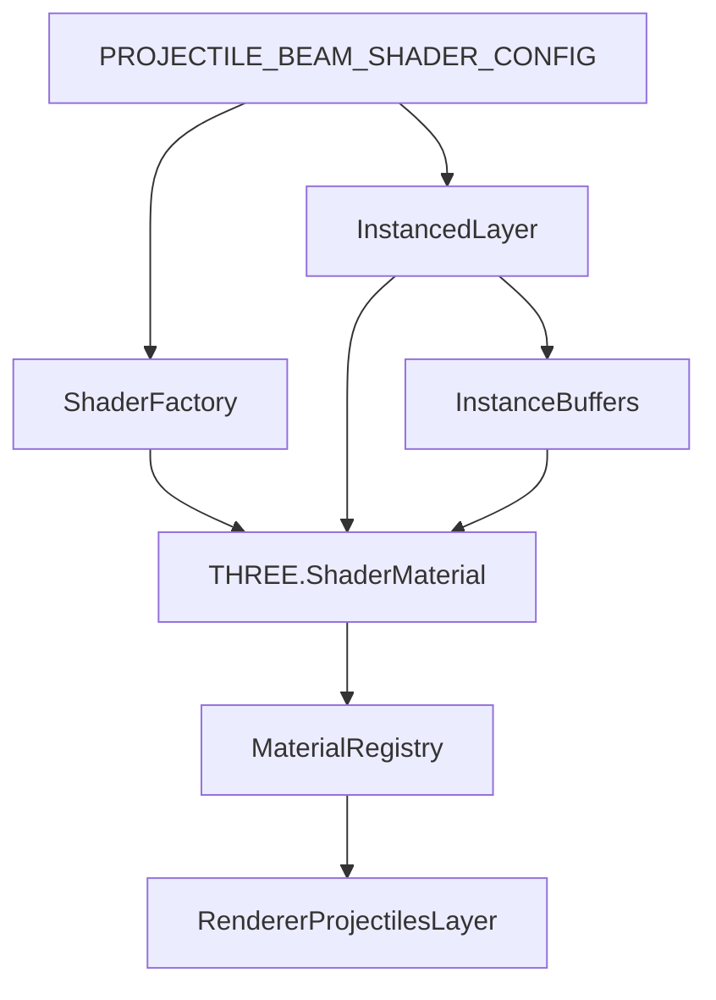

# TASK249 - Beam Shader Falloff

**Status:** Final
**Added:** 2025-10-14
**Updated:** 2025-10-14
**Confidence:** 0.88 (high — renderer/material registry patterns are familiar and prior beam groundwork exists.)

## Problem Statement

Beam projectiles currently reuse a basic MeshPhysicalMaterial variant, limiting visual fidelity: team tint is flat, distance falloff is linear, and post-processing integration relies on ad-hoc flags. We need a custom instancing-compatible shader that supports configurable near/far brightness and exponential falloff while remaining data-driven and performant.

## Requirements Traceability

| Req | Summary | Coverage Plan |
| --- | ------- | ------------- |
| R1 | Populate shader uniforms from config | Material factory unit test asserts uniforms equal config defaults |
| R2 | Provide per-instance brightness scalar | Instanced layer test verifies attribute exists and defaults to 1.0 |
| R3 | Apply inverse-squared falloff using uniforms | Shader factory test inspects fragment shader chunk for falloff logic; optional integration test renders GPU snippet when feasible |

## Architecture Overview



- Configuration lives alongside projectile visuals (`src/config/projectiles.ts`) exposing near/far brightness and exponent.
- A new `createBeamLaserShaderMaterial` factory builds a cached `THREE.ShaderMaterial` with uniforms seeded from config and instance color support enabled.
- `ProjectilesInstancedLayer` allocates an `InstancedBufferAttribute` (`instanceBeamBrightness`) storing a scalar per projectile (default 1.0) and assigns it to the mesh geometry; shader reads it via `attribute float instanceBeamBrightness`.
- Fragment shader computes normalized depth along beam (0 at origin, 1 at tip), applies inverse-squared falloff, clamps to config bounds, raises to exponent, and multiplies by instance color.

## Data Flow & Interfaces

### Config Surface

```ts
export interface BeamShaderFalloffConfig {
  nearBrightness: number; // default 1.0
  farBrightness: number; // default 0.5
  falloffExponent: number; // default 1.2
  falloffExponentBase?: number; // default 2.0 (inverse-squared)
}
```

Expose `PROJECTILE_BEAM_SHADER_CONFIG` from `src/config/projectiles.ts` with sane defaults and validation clamps (0 < far ≤ near ≤ 2).

### Shader Uniforms

```ts
uniform float uNearBrightness;
uniform float uFarBrightness;
uniform float uFalloffExponent;
uniform float uFalloffBase; // 2.0 for inverse-squared
```

Blending remains additive, depthWrite disabled, toneMapping off, vertexColors true, transparency true, and `userData.__copilot_forceColorWrite = true` to keep compatibility with BloomProvider.

### Instanced Attribute

```ts
attribute float instanceBeamBrightness;
```

Default value = 1.0. Consumers may later scale brightness per projectile (e.g., critical hits).

### Fragment Shader Sketch

```glsl
float segment = clamp(vBeamPos, 0.0, 1.0);
float invSquared = pow(1.0 / max(0.0001, segment * segment + 1.0), uFalloffBase);
float eased = mix(uNearBrightness, uFarBrightness, segment);
float brightness = pow(eased * invSquared, uFalloffExponent) * instanceBeamBrightness;
vec3 color = brightness * instanceColor.rgb;
```

## Error Handling Matrix

| Scenario | Detection | Response | Follow-up |
| --- | --- | --- | --- |
| Config values invalid (NaN or far > near) | Config validator | Clamp to safe defaults (near=1, far=0.5, exponent=1.2) and log warn once | Add telemetry counter if repeated |
| Shader compilation fails | try/catch around factory | Fallback to MeshBasicMaterial tinted by config near brightness and log warning | Surface in debug overlay |
| Instanced attribute missing | Runtime assertion in layer | Reallocate buffer, fill with 1.0, and continue; log debug warning in dev | Add unit test guard |
| Bloom provider strips colorWrite | Material initialization | Force `material.userData.__copilot_forceColorWrite = true` | n/a |

## Unit Testing Strategy

1. **Beam shader factory spec**
   - Instantiate factory, ensure material is `THREE.ShaderMaterial` with uniforms seeded from config and fragment shader contains `pow` with `uFalloffBase`.
2. **Instanced attribute spec**
   - Mount `ProjectilesInstancedLayer` in test harness; after beam updates confirm `geometry.hasAttribute('instanceBeamBrightness')` and values default to 1.0.
3. **Config clamp spec**
   - Import config module, force invalid env override (if present) and verify exported config clamps to safe bounds.

## Implementation Plan

1. Extend `memory/tasks/_index.md` with TASK249 entry and create execution log (this document).
2. Add `PROJECTILE_BEAM_SHADER_CONFIG` to `src/config/projectiles.ts`; include type, defaults, clamps, and optional environment override hook if patterns exist.
3. Author shader factory (`src/renderer/materials/beamLaserShader.tsx`):
   - Build `ShaderMaterial`, set defines/uniforms from config, attach `userData` flag, support instance color.
   - Cache the material by resource key to avoid reallocation.
4. Update `materialRegistry.tsx` to register new factory (supportsInstanceColor true, transparent, additive).
5. Update `ProjectilesInstancedLayer.tsx`:
   - Allocate and maintain `instanceBeamBrightness` attribute alongside colors/matrices (float32 buffer sized to capacity).
   - Write brightness = 1.0 (or derived) per instance; expose hook for future overrides.
6. Adjust fragment shader to multiply by instance color and brightness while preserving existing width/length scaling.
7. Update tests (Vitest) to cover config/uniforms/attribute.
8. Run `npx tsc --noEmit` and `npx vitest test/vitest/projectile-behaviours.spec.ts`.

## Open Questions

- Do we need runtime hooks to vary brightness (e.g., crit hits)? Not in scope; attribute enables future work.
- Should falloff exponent be configurable at runtime (UI)? Not required now; config change + reload is acceptable.

## Follow-up Ideas

- Add subtle scroll noise along beam using simplex texture sampled in shader.
- Expose color gradients per faction using additional uniforms or textures if future requirements demand.
